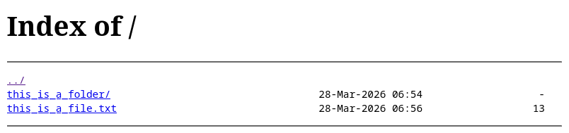

# Nginx Share


[](https://github.com/chen-ky/nginx-share/actions/workflows/container-publish.yml)

Containerised nginx server for easy sharing of a directory.

> ⚠️ This container is not suitable for website hosting as it allows someone to browser the website directory.

> ⚠️ This container supports only HTTP instead of HTTPS for now as my primary goal is to use this locally on a trusted network. HTTPS support might be added in the future. You should take steps, such as running it behind a reverse proxy with HTTPS if you want to encrypt your traffic.

```sh
podman pull ghcr.io/chen-ky/nginx-share:latest
```

## Screenshot



## Running the Container

The examples here publishes the port to 8080. You can change this to your desired port.

You can browse the shared directory at `htto://localhost:8080/`. Replace the domain/IP and port according to your setup.

### Sharing the volume of another container

```sh
podman run --interactive --tty --rm --publish 8080:80 \
    --volume-from=<container_name>
    --volume <volume_name>:/usr/share/nginx/html \
    ghcr.io/chen-ky/nginx-share:latest
```

### Sharing a local folder

```sh
podman run --interactive --tty --rm --publish 8080:80 \
    --volume <local_directory>:/usr/share/nginx/html:z \
    ghcr.io/chen-ky/nginx-share:latest
```
